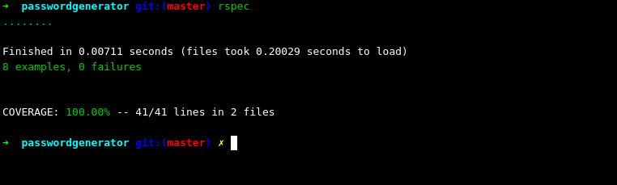
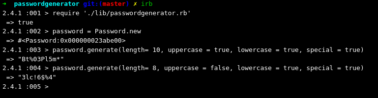

# Password Generator

[](https://coveralls.io/github/AaronRodrigues/passwordgenerator?branch=master)

## Developer Test

Create a password generator that, in a language of your choice, will create a secure password.The password generator should have the following signature:String generatePassword(int length, boolean uppercase, boolean lowercase, boolean number, boolean special)(This is java syntax but you should be able extrapolate to your language of choice)
Where:
length is the length of the returned string
uppercase    is    whether    to    include    ### Technologies used
- Ruby 2.4.1
- Test framework: RSpec
- Version Control System: GITuppercase characters  A -Z  
lowercase  is  whether  to  include lowercase  characters  a -z  
number  is  whether  to include 0 –9
special is whether to include the following keyboard characters ``!$%&*@^`` 

Raise/return an error if the rules given can never be alid.The solution should be self-contained with no dependencies on external libraries/services that could generate a password.Ensure you produce production-ready code to the best of your abilities. Write a short document describing any issues you encountered developing this.

## User Stories

```
As a user,
So that I have a secure password,
I would like my password to have a predefined length

As a user,
So that I have a secure password,
I want to be able to include lowercase letters in my password

As a user,
So that I have a secure password,
I want to be able to include uppercase letters in my password

As a user,
So that I have a secure password,
I want to be able to include lowercase letters in my password

As a user,
So that I have a secure password,
I want to be able to include numbers in my password

As a user,
So that I have a secure password,
I want to be able to include !$%&*@^ in my password

As a user,
So that my password requirements are met,
I would like to know when the password is invalid

``` 
### Technologies used
- Ruby 2.4.1
- Test framework: RSpec
- Version Control System: GIT

### Installation

1. Clone this repository by typing the following in the command line.
   ```
   git clone git@github.com:AaronRodrigues/passwordgenerator.git
   ```
2. Navigate to the directory and install bundler
   ```
   gem install bundler
   ```
3. To install dependencies, type:
   ```
   bundle install
   ```
### Test Coverage
    
   

1. To run tests, in the Terminal type:
   ```
   rspec
   ```
### Run the Program

1. Open Terminal
2. Type 
   ```
   irb
   ```
   This opens the interactive ruby shell
3. Type
   ```
   require './lib/passwordgenerator.rb'
   ```
4. You can now create a new Password by typing:
   ```
   pass = Password.new
   password.generate(length= 10, uppercase = true, lowercase = true, special = true)
   ```
5. You can also change any of the parameters
   ```
   pass = Password.new
   password.generate(length= 8, uppercase = false, lowercase = true, special = true)
   ```
   

### Assumptions Made

   1. Default length for the password is 15 characters
   2. Minimum Length for the password is 4 characters

      I initially wanted to go through each case for less than 3 characters. This would lead to writing more exception statements in cases such as:
      ```
      length = 2, uppercase = false, lowercase = true, numeric = true, special = true
      length = 2, uppercase = false, lowercase = false, numeric = true, special = true
      length = 2, uppercase = false, lowercase = true, numeric = false, special = true
      length = 2, uppercase = false, lowercase = true, numeric = true, special = false
      etc
      ```
      I made the assumption that a password would be too insecure if it had less than 4 characters. I did reach out with a question regarding the minimum length for the password. I was told to make an assumption since it is the weekend and the question could not be answered. 
   3. All conditions regarding uppercase, lowercase, numbers and special characters are set to true by default
   
### Further improvements
- Creating an interface for the application
- After discussion with the team, decide if a max length for the password is necessary and implement it.
